Aim of this project

The idea for this project originated a long time ago during discussions with Frytkownica (one of the authors of SoW) about tracking battle results in TTS to better fine-tune card balance. The first recorded discussion dates back to December 2023.

At some point, I decided to build a simulator to generate results more quickly and obtain statistically stronger insights. After several iterations (this is the third version of the simulator 🫠), the project has now reached its first major milestone (February 2025), with all base game factions fully implemented.

Below, you will find the simulator results along with the assumptions used in building the simulation model.

[Setting stage](#setting-stage)

[Simulations’ analysis](#simulations-analysis)

[Stage level](#stage-level)

> [Unit size](#unit-size)
>
> [Unit type](#unit-type)
>
> [Dice level](#dice-level)

[Card analysis](#card-analysis)

> [Overall distribution](#overall-distribution)
>
> [Reliability](#reliability)
>
> [Situationality](#situationality)
>
> [Granular investigation](#granular-investigation)

[Appendix](#appendix)

> [How the simulator was built](#how-the-simulator-was-built)
>
> [Assumptions](#assumptions)
>
> [Unit size and units](#unit-size-and-units)
>
> [Combat Deck](#combat-deck)
>
> [Combat abilities](#combat-abilities)
>
> [Combat Resolution](#combat-resolution)
>
> [Unit type](#unit-type-1)
>
> [Card Analysis metrics](#card-analysis-metrics)
>
> [Update log](#update-log)
>
> [Faction descriptions](#faction-descriptions)
>
> [Eldar “Win by not being where the fight is supposed to be”](#eldar-win-by-not-being-where-the-fight-is-supposed-to-be)
>
> [Chaos “Every choice you make is probably wrong”](#chaos-every-choice-you-make-is-probably-wrong)
>
> [Orks “More dice, more bodies, more yelling”](#orks-more-dice-more-bodies-more-yelling)
>
> [Space Marines: “I am still here. Are you?”](#space-marines-i-am-still-here.-are-you)

## Setting stage

Before we start analysing factions, we need to understand what each faction's strong and weak areas are.

For it, we let AI analyse the text of following articles ([SM](https://boardgamegeek.com/thread/1391636/the-adeptus-astartes-ultramarine-faction-overview), [CSM](https://boardgamegeek.com/thread/1394002/rage-unending-world-eaters-faction-overview-and-di), [Orks](https://boardgamegeek.com/thread/1399451/waaaaagh-evil-sunz-faction-overview-and-discussion), [Eldar](https://boardgamegeek.com/thread/1392670/tears-of-isha-iyanden-faction-overview-and-discuss)) in one go to come up big-picture identity bins.

Think of each faction as living on a few shared axes:
- Raw Power (how hard they hit / how much punishment they take)
- Mobility & Reach (movement tricks, redeployment, surprise)
- Resilience (defense, morale play, rallying)
- Complexity (decision load, sequencing, conditional effects)
- Combat Deck Texture (situational vs generic)

TL;DR table

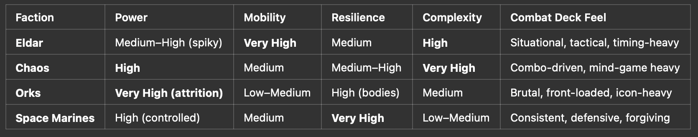

Based on that, we can write down hypothesis for each battle

| **Matchup**   | **Expected Skew** |
|---------------|-------------------|
| Orks vs SM    | 50-50             |
| Orks vs CSM   | 50-50             |
| SM vs CSM     | 50-50             |
| Eldar vs Orks | Orks              |
| Eldar vs CSM  | CSM               |
| Eldar vs SM   | SM                |

## Simulations’ analysis

Attacker win rate = \# of attacker wins / \# of battles

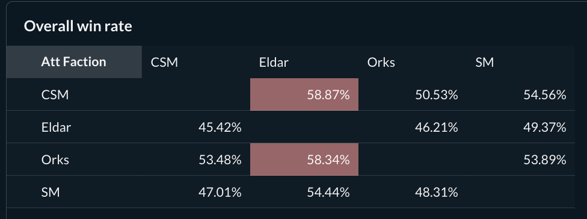

To verify that the simulator behaves as expected, we use the **Space Marines vs Orks** matchup as a calibration benchmark.

This matchup is intentionally chosen because it is the “least complex” one. Card effects are relatively straightforward, with limited sequencing tricks or situational interactions. In theory, this should produce a roughly **50–50 outcome** if the simulator is not biased.

The results align well with that expectation. The observed win rate deviates by only **4 percentage points from 50–50**, which is within an acceptable range given the scale of simulations. This gives confidence that the model is structurally balanced. ✅

It is also expected that **Eldar win rates appear slightly below average** in this baseline setup. The simulator assumes largely random decision-making — effectively answering the question:

“What happens if nobody plays especially well?”

Because Eldar rely heavily on timing, sequencing, and situational play, they naturally underperform in a random-play environment. However, when we later analyse card-level data, we can still clearly observe which plays are correct and how they shift win probability when used properly.

Across all matchups, the overall average attacker win rate is **51.7%**.

Given that each matchup consists of **3 million simulations**, this small deviation from 50% can be considered statistically stable and a strong validation of the model’s calibration.

Overall, win rates align with our hypothesis.

## Stage level

Regarding the simulator’s assumptions, each fight is divided into three stages (early, mid, and late), with **1 million simulations run per stage**. More information about stage logic can be read from Appendix.

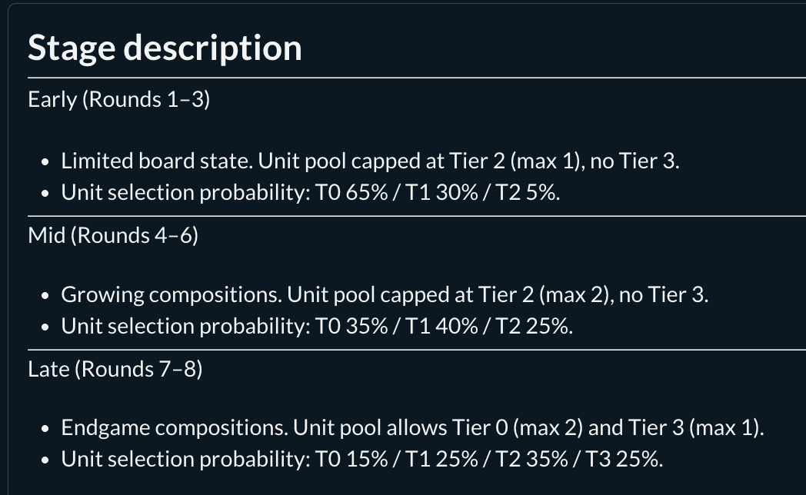

The above chart shows attacker win rates, color-coded as follows:

- **Yellow**: \<43%

- **Red**: \>57%

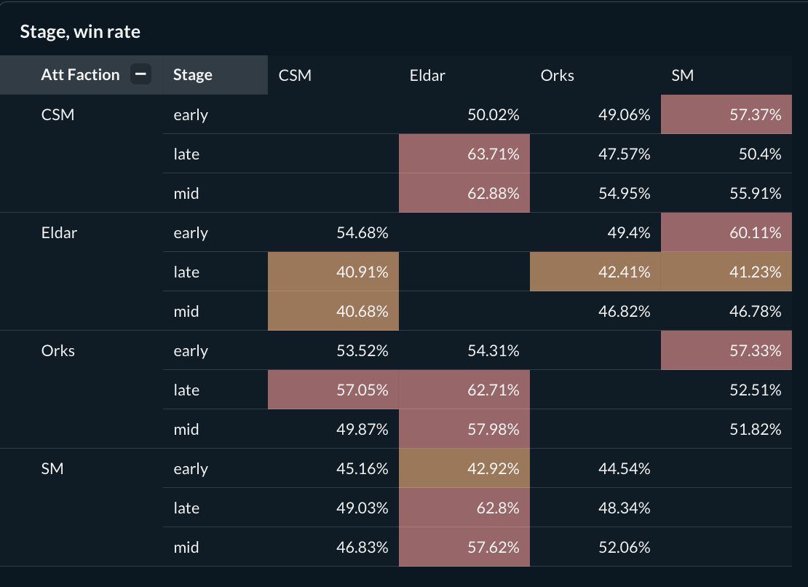

Most matchups (58%, 21 in total) can be considered well balanced, as the attacker win rate remains within the **43–57% range**. This range is used throughout the document as a practical threshold for competitive balance.

Five matchups fall below 43%, and ten exceed 57%. However, the majority of these deviations are related to **Eldar** (12 out of 15, or 80%). Given Eldar’s strong dependence on correct timing and sequencing, this skew is not unexpected in a largely random-play simulation environment.

The remaining three higher-skew matchups — **early CSM vs SM**, **early Orks vs SM**, and **mid Orks vs CSM** — sit close to the upper threshold and do not indicate extreme imbalance.

In the next chapter, we focus specifically on the **Orks vs Eldar matchup in the late stage**. This pairing represents one of the most polarized faction dynamics:
- **Orks**: direct, icon-heavy, pressure-oriented (“win by overwhelming”)
- **Eldar**: situational, timing-sensitive, and strategically selective

Because their combat philosophies are fundamentally different, this matchup provides a useful case study to understand how raw power interacts with conditional play in the simulator.

### Unit size 

To better understand where the largest impacts originate, we now move to a **unit-level analysis**.

**Definition of Unit Size**

Reinforcements are **not included** in this classification.
- **Small**: 1–2 units
- **Medium**: 3 units
- **Large**: 4–5 units

For each battle, we compare attacker and defender sizes and classify the matchup as:
- **AttSmaller**
- **Equal**
- **AttLarger**

Additionally, we indicate whether reinforcements were used (True / False), but reinforcements are not part of the size category itself.

The following analysis focuses specifically on the **Orks vs Eldar matchup in the late stage**, although the overall unit-size distribution is broadly consistent across all stages and faction pairings.

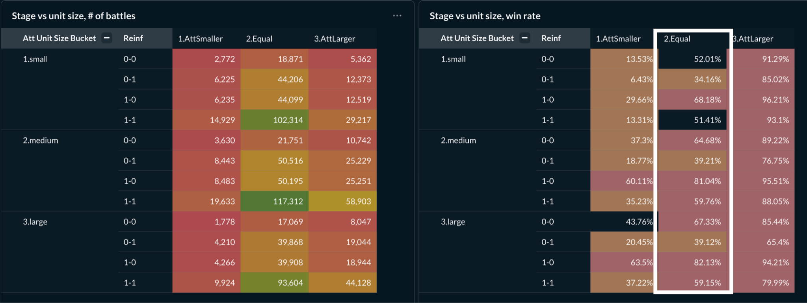

We observe that the highest concentration of battles occurs in **equal-size matchups** (37%). Because these represent the most common scenario, they will be our primary focus in the following chapters.

Across most size bins (except AttSmaller), **Orks have the advantage**, which supports our earlier hypothesis:
- Orks perform well in direct, even engagements.
- Eldar prefer selective engagements rather than fair fights.

**Validation: Win Rate Reflection Check**

To ensure that the simulator behaves consistently, we also check for symmetry effects.

For example:
- If *AttSmaller + reinf 1–0* strongly favors one side,
- Then the mirrored scenario (*AttLarger + reinf 0–1*) should roughly balance it.

If those reflections do not approximately offset each other, it could indicate structural bias.

This reflection delta can be interpreted as:
- **\< 0 percentage points** → Defender has the advantage
- **~ 0 percentage points** → Balanced
- **\> 0 percentage points** → Attacker has the advantage

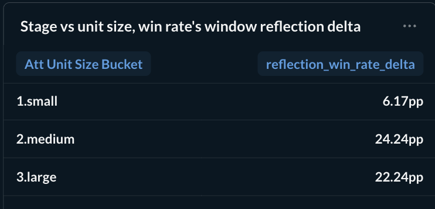

From the results, we see that in **medium-larger battles**, Eldar begin to lose fair fights more consistently.

This further reinforces our hypothesis:

Eldar performance is highly situational and less effective in direct, large-scale engagements under random play conditions.

In the next chapter, we narrow our analysis to:

**Orks vs Eldar – Late Stage – Equal Battles**

This segment represents the majority of cases (63%) and therefore provides the most statistically meaningful insight into how these two factions interact when starting from comparable positions.

#### Unit type

Next, we drill down further to determine whether the observed impact is driven by **specific unit compositions**, not just by unit count.

Unit type is defined based on the **entire composition of units participating in each battle**, rather than looking at individual units in isolation. For a detailed explanation of how unit types (Swarm, Core, Core+, Heavy, Elite) are constructed, please refer to the **Appendix – “Unit type”** section.

In the late-stage Orks vs Eldar matchup, we observe that the largest share of battles (62%) occurs in **Core and Core+ equal matchups**.

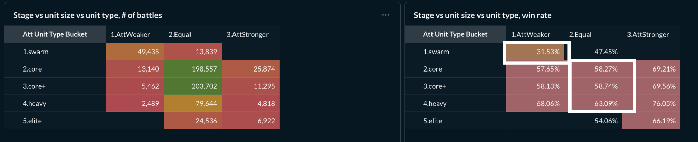

In these cases, Orks show a **58% win rate**, which is only 1 percentage point above our critical imbalance threshold. This is an important insight:
- Even in equal-quality compositions, Orks maintain a slight advantage under random play.
- However, the margin is small enough to suggest that **Eldar can win these fights if cards are played correctly**.

An interesting pattern also emerges: when higher-tier cards (Tier 2–3) are available, but the actual battle composition consists mostly of Tier 0–1 units, **Eldar tend to perform better**.

This suggests that:
- Eldar benefit disproportionately from high-quality card effects.
- They are less dependent on raw unit tier strength compared to Orks.
- Their advantage comes from *leveraging tools*, not just fielding stronger units.

Overall, this reinforces the idea that:

Eldar strength is conditional and execution-dependent, while Orks rely more on structural pressure.

Next, we will see if initial dice outcome impact battle out come in overall

###### Dice level

Next, we examine whether the **initial dice outcome** significantly impacts the overall battle result.

Dice results are grouped into six categories based on two dimensions:

**Bolters**
- **Low**: up to 2
- **Medium**: 3–4
- **High**: 5+

**Morale**
- **\_M**: at least +1 Morale die
- **\_NoM**: no Morale die

This creates six combined categories (e.g., Medium + \_M, Low + \_NoM, etc.).

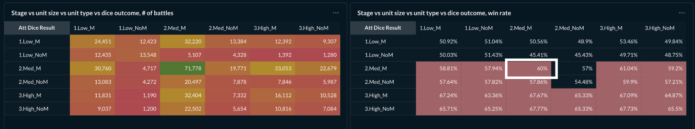

We observe that the highest concentration of battles occurs in the **3–4 Bolters with Morale** category, which aligns with the expected dice distribution. In this category, Orks show a **60% win rate**.

More importantly, when Orks start with **low Bolters (maximum 2)**, their win rate drops by approximately **7 percentage points** compared to their overall performance.

This indicates that:
- Initial dice rolls do influence outcomes.
- Orks, in particular, rely heavily on early offensive pressure.
- A weak opening roll reduces their structural advantage.

However, the effect is not overwhelming — meaning dice matter, but they do not fully determine the result. Faction mechanics and card interactions still play a significant role.

## Card analysis

Card analysis requires a slightly different approach compared to earlier sections.

At this stage, we also need to consider a practical limitation, the simulator data is stored in a **local database**, which means we cannot analyze every possible combination without creating an unmanageable number of rows. Therefore, we define a controlled set of filtering dimensions.

**Final Filtering Dimensions**
- Stage
- Unit size similarity
- Unit type similarity
- Damage Efficiency
- Morale Efficiency

(Additional variables are described in more detail in the Appendix.)

When expanded across all combinations, this results in:

4 (attacker factions)

× 3 (defender factions)

× 3 (stage)

× 3 (unit size similarity)

× 3 (unit type similarity)

× 3 (round)

× 5 (Damage Efficiency bins)

× 5 (Morale Efficiency bins)

× 9–14 (attacker cards)

× 9–14 (defender cards)

≈ **1.8 million rows** in the database.

This dimensionality is large enough to capture meaningful patterns, but still computationally manageable.

### Overall distribution

For both attacker and defender, the card distribution across rounds follows a similar shape. This is expected, as card selection probabilities are weighted by stage (see “Combat Deck” section under Appendix). Higher-tier cards are more likely to be played in mid and late stages, which naturally shapes the distribution.

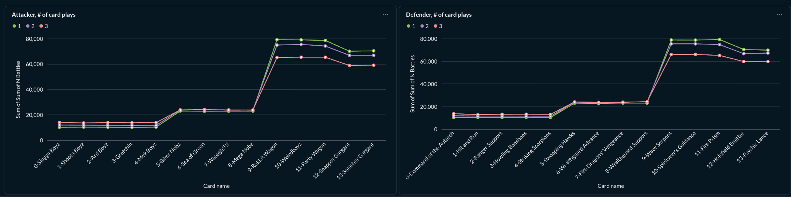

Next, we analyse how **reliable** and **situational** individual cards are. We focus on the **Orks vs Eldar late-stage matchup**, as it provides the most polarized faction interaction and therefore the clearest signal.

#### Reliability 

Reliability answers a simple question:

How often is this card a “good play” across different battle contexts?

For each card in each round, we observe multiple combinations based on:
- Damage Efficiency
- Morale Efficiency

For every combination, we calculate the win rate.If the win rate is **above 40%**, we classify that scenario as a *successful outcome* for the player.

The **Reliability Rate** is then:

The percentage of scenarios where the card produces a “good” outcome.

High reliability means:
- The card works in many situations.
- It does not require perfect setup.
- It is broadly safe to play.

Low reliability means:
- The card only works under specific conditions.
- Timing and sequencing matter heavily.

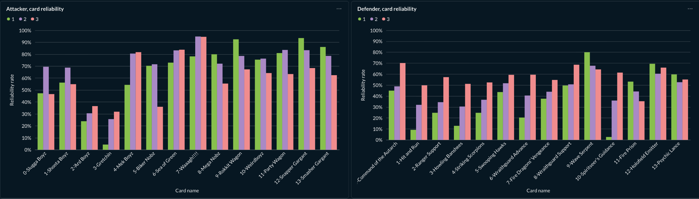

Orks

- For Orks, nearly all cards perform well against Eldar in most rounds.

  - The only clear exception is **Gretchin**, which is expected given that this is a ground-focused battle and Gretchin have limited impact.

Eldar:

- There are clear distinctions between strong and weak openers.

  - Strong opening cards: Wave Serpent, Holofield Emitter, Psychic Lance, Fire Prism

  - Weak opening cards: Spiritseer's Guidance, Wraithguard Advance,

- Round 2-3

  - Reliability increases significantly compared to Round 1. This suggest that

    - If earlier cards are played correctly (not randomly), Eldar’s win probability improves considerably. Even in equal-sized battles (which are not their ideal scenario).

  - It is also interesting to see Command of the Autarch and Ranger Support performing relatively well, reinforcing the importance of controlled sequencing.

#### Situationality

Reliability alone does not tell the full story. A card might be frequently “good” but still highly volatile.

Situationality measures:

How much does a card’s performance fluctuate across different battle states?

To measure this, we calculate the **standard deviation of win rates** across bins. For example:
- \[50%, 20%, 90%\] → highly situational (large spread)
- \[50%, 55%, 58%\] → stable (low spread)

We then compare card-level volatility to the faction’s overall volatility. Interpretation:
- **Positive value** → Card diverges strongly from baseline → more situational
- **Negative value** → Card is more stable than average

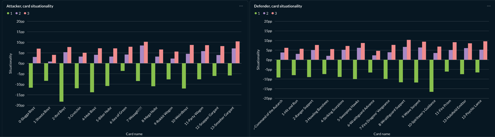

Orks

- Round 1

  - The strongest opening appears to be **Sea of Green**, which shows:

    - High reliability

    - Low situationality

Eldar

- Round 1

  - For Eldar, Round 1 cards heavily influence the rest of the battle.

  - Spiritseer's Guidance isn’t a card to be played in 1st round

    - Low reliability

    - Low situationality

    - Very high probability of losing if played early.

- Round 2-3

  - Tier 2-3 cards have a great reliability, but they are very situational (having ~10pp)

**Summary Insight**
- Ork cards are broadly reliable and stable.
- Eldar cards are timing-sensitive and conditional.
- Early decisions matter disproportionately for Eldar.
- Later rounds reward correct sequencing but punish mistakes.

This strongly aligns with the intended faction identities.

##### Granular investigation

So far, we have analysed patterns at an aggregated level. Now, we zoom in further.

In this section, we examine **specific card-to-card interactions** to understand whether individual cards behave as intended and whether observed win rates make tactical sense. This allows us to validate:
- Whether strong cards actually counter what they are supposed to counter
- Whether certain combinations create unintended spikes
- Whether sequencing assumptions hold at a micro level

**All Ork Cards vs Wave Serpent (Round 1)**

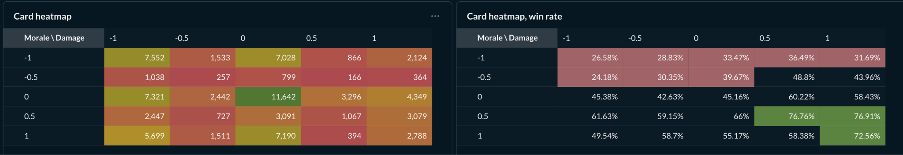

When we look at all Ork opening cards against **Wave Serpent (Round 1)**, we see that in the majority of cases the win rate sits around **45%**. This is a healthy result for Eldar:
- Despite Orks’ structural strength,
- Eldar remain competitive in most bins,
- Even in scenarios where Orks gain a morale edge.

However, once Orks deal enough early damage to meaningfully affect morale, they usually convert that into a win. This reinforces the idea that:

Orks win by converting early pressure into sustained advantage.

**Sea of Green vs Wave Serpent (Round 1)**

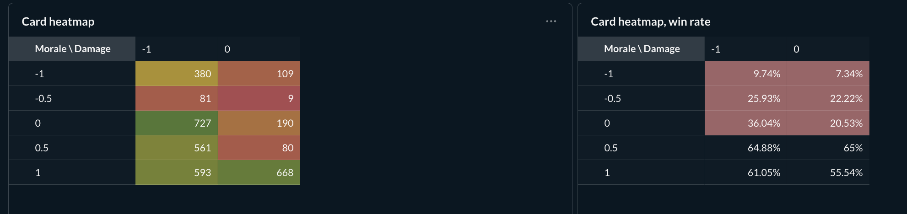

This specific pairing appears in **3,398 battles**, which is statistically smaller but still meaningful. Overall, Orks hold a slight advantage at **55% win rate**. The pattern shows:
- If Eldar fail to boost morale or generate sufficient early damage,
- The extra Ork bodies (“extra meat”) overwhelm the exchange.

This matchup behaves logically:
- Sea of Green increases pressure through volume,
- Wave Serpent must offset that pressure through positioning or morale stabilization.

**All Ork Cards vs Spiritseer’s Guidance (Round 2–3)**

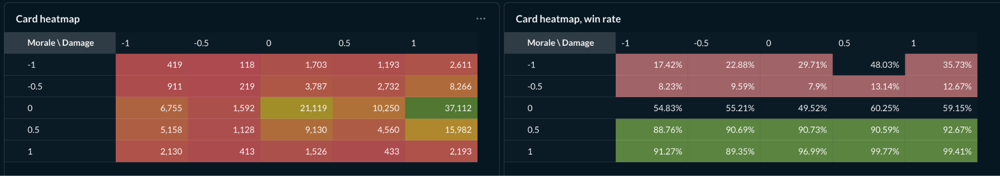

When Spiritseer’s Guidance is played in Round 2 or 3, the outcome depends heavily on **morale preservation**. If Eldar can use the card without significantly harming their own morale position, the battle often shifts in their favor. This supports the earlier conclusion:

Eldar cards are powerful — but only if the timing and state are correct.

**Snapper Gargant vs Spiritseer’s Guidance (Round 2–3)**

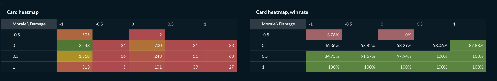

In this specific interaction, the same pattern appears.If Eldar avoid morale collapse after playing Spiritseer’s Guidance, Orks struggle to close the battle — even with Snapper Gargant pressure. Again, the deciding factor is not raw damage, but **post-card morale state**.

**Key Takeaway**

From these granular investigations, we can conclude:
- Orks win through consistent pressure and structural advantage.
- Eldar win through correct sequencing and morale control.
- Equal matchups are not inherently unwinnable for Eldar.
- Under proper play (non-random sequencing), Eldar can overcome Ork pressure even in fair fights.

Action item: use round-card win rates for more scripted play.

## Appendix

### How the simulator was built

The simulator was implemented in Python. Each card effect was individually tested and validated across a wide range of inputs (units, dice outcomes, and played cards) to ensure correct behavior.

Within the simulator, any required in-game decisions (for example, removing dice to gain temporary effects) are resolved randomly. This approach avoids introducing predefined faction- or card-specific logic, which could otherwise bias the results.

With a large number of simulations (1 million per scenario), each card is sufficiently represented, allowing us to observe its impact in a statistically robust and unbiased manner.

#### Assumptions

For simplicity (for now), we focus only on ground battles, as the majority of battles involve ground units. Bastion is important in critical battles, but for this proof of concept (PoC), we are ignoring it.

##### Unit size and units

We need to determine the unit sizes for both attacker and defender. We assume that the battle is important for both sides, and the attacker may or may not have an advantage in unit size. The following describes the logic for deriving unit size (and number of units):

1.  Attacker unit size

    1.  Probabilities \[1 - 0.15, 2- 0.25,3 - 0.4, 4 - 0.15, 5 - 0.05\]

2.  Defender unit size

    1.  Depends on the attacker’s size, adjusted as follows (gapped with 5)

    2.  Probabilities \[-1 - 0.3, 0 - 0.6, 1 - 0.1\]

3.  Attacker and defender units are determined independently (i.e., one side’s units do not depend on the other’s). This allows us to analyse unbalanced battles as well.

    1.  Early (Rounds 1–3)

        1.  Limited board state. Unit pool capped at Tier 2 (max 1), no Tier 3.

        2.  Unit selection probability: T0 70% / T1 25% / T2 5%.

    2.  Mid (Rounds 4–6)

        1.  Growing compositions. Unit pool capped at Tier 2 (max 2), no Tier 3.

        2.  Unit selection probability: T0 40% / T1 40% / T2 20%.

    3.  Late (Rounds 7–8)

        1.  Endgame compositions. Unit pool allows Tier 0 (max 2) and Tier 3 (max 1).

        2.  Unit selection probability: T0 10% / T1 35% / T2 45% / T3 10%.

    4.  If a tier has 0 units left, probabilities are adjusted accordingly.

    5.  Additionally, we add reinforcements with probabilities:

        1.  max(\[0 - 0.3, 1 - 0.4, 2 - 0.2, 3 - 0.1\], \# of units)

In the analysis, we will derive bins for different unit sizes and power levels. Please read “Unit size” and “Unit power” chapters under “Stage level”.

##### Combat Deck

Next, we roll dice and determine the combat deck (drawn cards and unselected) and adjust based on upgrades per round:

- Early (Rounds 1–3)

  - Combat upgrades: Tier 0 only — 1 (30%), 2 (50%), 3 (20%).

- Mid (Rounds 4–6)

  - Combat upgrades: 2× Tier 0 guaranteed, Tier 2 — 1 (50%), 2 (50%).

- Late (Rounds 7–8)

  - Combat upgrades: 1× Tier 0 + 2× Tier 2 guaranteed, Tier 3 — 1 (80%), 2 (20%).

After drawn and undrawn cards have been selected, then we adjust our hand based on probabilities:

- early - leave as is

- mid - tier 2 cards are more likely to be played \> start / tier 0

- late - tier 2-3 cards are more likely to be played \> tier 0 \> start

##### Combat abilities

If one side has to make a decision between multiple options (or amount), then it’s all random. Only place, where simulator forcefully intervenes is, if card effect force to rout/destroy units, then it will prefer lower tier routed units against higher tier unrouted units e.g.

Some cards allow you to convert up to 8 dice to icon X. In such cases, we are intervening and applying geometric weights - based on the situation either converting more in later combat rounds or less in early rounds. Effected cards: Break the Line; Emperor's Glory;

##### Combat Resolution

When one side has to take damage in, then priority is based on tier/moral/hp system

The core idea is to **assign relative weights to eligible units** and select a target via weighted randomness. This allows the model to express intent while preserving variance and statistical stability.

**Design Goals**

- Produce believable combat outcomes without hard rules

- Avoid deterministic or exploitable targeting

- Scale cleanly to millions of simulations

- Preserve statistical smoothness across aggregates

- Degrade gracefully in edge cases

**Key Principles**

1.  Soft Prioritization  
    Units are never strictly forced or forbidden as targets (except for dead units). Instead, priorities are expressed through **weights**, not rules.

2.  Damage Efficiency  
    Incoming damage should be absorbed by units that convert it most efficiently, rather than always protecting or sacrificing the same tier.

3.  Stability Over Optimality  
    The system favors consistent aggregate behavior over perfect tactical decisions in individual fights.

**Tier Preference Model**

Incoming damage is mapped to a *preferred unit tier*:

| **Incoming Damage** | **Preferred Tier** |
|---------------------|--------------------|
| ≤ 2                 | Low tier           |
| 3–4                 | Mid tier           |
| ≥ 5                 | High tier          |

This preferred tier represents the **most damage-efficient recipient**, not an exclusive choice.

**Weight Calculation**

Each eligible unit starts with a base weight of 1.0.

**Tier Distance Penalty**

The distance between a unit’s tier and the preferred tier is calculated:

tier_distance = \|unit_tier − preferred_tier\|

The final weight decays exponentially:

weight ∝ exp(−tier_distance)

This ensures:

- Strong preference for optimal tiers

- Smooth fallback to suboptimal tiers

- No sharp cutoffs or thresholds

**Routed Unit Handling**

Routed units are handled specially:

- Routed units are **ignored if any unrouted units are alive**

- If all remaining units are routed, they become eligible

- Routed units receive a bonus proportional to their HP

This prevents deadlocks while still discouraging premature sacrifices.

**Target Selection Flow**

1.  Collect alive, unrouted units

2.  If none exist, fall back to alive routed units

3.  Compute weights for candidates only

4.  Perform weighted random selection

5.  Return the chosen unit

A safety fallback ensures a target is always selected, even if all weights collapse.

##### Unit type

Definitions:

- Elite ratio: share of tier 2 & 3 units

- Average power: mean unit power after dice effects

  - tier powers:

    - refin - 1

    - tier0 - 2

    - tier1 - 3

    - tier2 - 5

    - tier3 - 7

  - avg unit power = SUM(# of tier units \* tier power) / \# of units

Classification rules:

- **Swarm**: No elite units present and low average power (\<2.5). Represents high-volume, low-quality compositions.

- **Core**: Mixed low- and mid-tier units with moderate power. Represents standard, balanced compositions.

- **Core+**: Meaningful elite presence (\>0.2) with above-average power (\>3). Represents upgraded or synergy-driven compositions.

- **Heavy**: Majority elite units (\>0.5) and high average power (\>3.5). Represents high-quality, low-count armies.

- **Elite**: Almost entirely elite units (\>0.8). Represents top-end, late-game compositions.

Those unit types are distributed in stages accordingly:

- **Early (Rounds 1–3)**

  - Low-tier focused environment. Swarm and Core units dominate board presence.

  - Core+ units are rare (≤1 available), Heavy and Elite units are unavailable.

  - Most battles are decided by unit count and basic synergies.

<!-- -->

- **Mid (Rounds 4–6)**

  - Mid-tier transition environment. Core units remain dominant, with growing Core+ presence.

  - Up to two Core+ units can appear; Heavy and Elite units remain unavailable.

  - Battles increasingly hinge on mixed Core / Core+ compositions.

<!-- -->

- **Late (Rounds 7–8)**

  - High-tier environment. Core+ units define most compositions, supported by Heavy and Elite units.

  - Heavy and Elite units become meaningful contributors rather than edge cases.

  - Battle outcomes are driven by unit quality and late-game synergies.

Attacker vs defender unit type are measured by following way

###### Size Relation Logic

This logic determines the relative strength relationship between attacker and defender unit types based on game stage. It works in three steps:

1.  Direct Equality

    1.  If attacker and defender are the same unit type → "2.Equal".

2.  Stage-Based Counter Rules

    1.  Each game stage (early, mid, late) defines which unit types are considered valid counters to others. This models contextual balance (e.g., certain unit types trade efficiently in specific stages).

        1.  Early: swarm ~ core

        2.  Mid: swarm ~ core, core ~ core+

        3.  Late: swarm ~ core ~ core+ ~ heavy

3.  Fallback Numeric Comparison

    1.  If no stage rule applies, unit types are compared by predefined rank (UNIT_RANK).

        1.  If attacker rank \> defender rank → "3.AttStronger".

        2.  Otherwise → "1.AttWeaker".

**Purpose**

This function abstracts raw unit tiers into a stage-aware matchup classification, allowing the simulator to:
- Capture evolving battlefield dynamics (early vs mid vs late)
- Model soft counters without hardcoding outcomes
- Keep combat evaluation consistent and interpretable

It prevents purely linear tier comparisons and introduces contextual balance logic.

##### Card Analysis metrics

To evaluate cards in a universal and comparable way, we define two core metrics that measure how a card shifts the battle state.

Instead of looking only at raw win rates, we compare the **state before and after a card is played** (for example: start of battle → end of Round 1, or end of Round 1 → end of Round 2).

This allows us to measure the *impact* of a card, regardless of faction.

**1. Damage Efficiency**

Damage Efficiency measures how the total damage exchange shifted between attacker and defender.

It is scaled from:
- **-1** → Defender dealt all meaningful damage
- **0** → Damage exchange was balanced
- **+1** → Attacker dealt all meaningful damage

In simple terms:

Who benefited more from the damage trade?

This captures both direct damage and defensive mitigation (shields, routing effects, etc.).

**2. Morale Efficiency**

Morale Efficiency measures how the total morale balance shifted after the card was played.

It is also scaled from:
- **-1** → Defender gained full morale advantage
- **0** → No meaningful morale swing
- **+1** → Attacker gained full morale advantage

This includes morale gained or lost via:
- Dice conversions
- Card effects
- Routing interactions
- Unit destruction

In simple terms:

Who gained psychological momentum?

**Why These Two Metrics?**

Together, Damage Efficiency and Morale Efficiency capture:
- Pure combat impact (damage)
- Psychological / control impact (morale)
- Both general and unit-level effects
- Short-term and cascading effects

They allow us to evaluate cards in a consistent way across factions and stages.

**Interpreting the Two Metrics**

From the attacker’s perspective, we can split outcomes into four broad categories:
- High Damage / High Morale → **Strong play**
- High Damage / Low Morale → Aggressive but risky
- Low Damage / High Morale → Strategic setup
- Low Damage / Low Morale → Poor trade

This framework allows us to analyze cards beyond just “did it win or lose?” and instead understand *how* it shifted the battle.

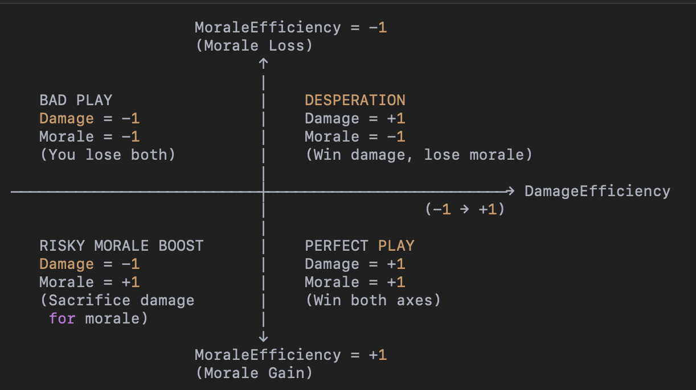

#### Update log

- ~~logic flaw in morale count~~

- ~~reshape unit size (don’t include reinf)~~

- ~~dice selection on two level~~

- ~~put higher priority to tier cards in mid/late battles~~

- ~~damage phase: give weights for all units and selection is random (this is better than pre scripted)~~

- ~~validate battles w. odd win rates (too high or low)~~

- ~~maximise card effects~~

- ~~new idea around battle situation (comparing prev and new state differences)~~

  - ~~MoraleEfficiency = MoraleSwing / (\|ΔEnemyMorale\| + \|ΔPlayerMorale\| + ε)~~

  - ~~DamageEfficiency = DamageSwing / (\|ΔEnemyDamage\| + \|ΔPlayerDamage\| + ε)~~

- TODO: for each faction find more “scripted” playstyle *“What happens if each faction plays like it ‘wants’ to play?”* and compare win rates against random play.

  - Having each card play win rate, then this is the first input

  - After it, we can apply mathematical models to increase each factions’ win rates.

### Faction descriptions 

Following text is copy-paste from AI

#### Eldar “Win by not being where the fight is supposed to be”

**Core characteristics**
- **Power**: Spiky rather than steady
- **Mobility**: Best in the game (fleet + Webway + card effects)
- **Resilience**: Indirect — avoid damage, retreat, reposition
- **Skill ceiling**: Very high

Eldar are not about standing and trading. They’re about:
- Choosing *when* combat happens
- Making fights asymmetric
- Turning movement rules into weapons

They feel fragile because they *are* — but the deck is designed to prevent fair fights from happening in the first place.

**Combat deck character**

**Highly situational, timing-sensitive, and positional**

Common traits:
- Many cards are **“bad” if played at the wrong time**
- Lots of **movement / retreat / dice conversion**
- Morale wins are common but **earned**, not automatic
- Rewards players who think 1–2 rounds ahead

Examples of deck texture:
- **Hit and Run / Ranger Support** → strategic movement disguised as combat
- **Howling Banshees / Wraithguard Advance** → forced routing, but only if Morale is managed
- **Spiritseer’s Guidance** → lose early, win late

**Straightforward?** ❌

**Forgiving?** ❌

**Expressive?** ✅ very

Eldar combat decks feel like a toolkit. If you don’t know *why* you’re playing a card, you probably shouldn’t play it.

#### Chaos “Every choice you make is probably wrong”

**Core characteristics**
- **Power**: Extremely high ceiling
- **Mobility**: Average, but deceptive
- **Resilience**: Flexible (can turtle or spike)
- **Skill ceiling**: Highest in the game

Chaos is the **mind-game faction**. Their strength is not just numbers — it’s **forcing bad decisions**.

They excel at:
- Presenting opponents with **lose–lose choices**
- Switching axes mid-combat (Offense ↔ Morale ↔ Defense)
- Exploiting routed units better than anyone

**Combat deck character**

**Combo-oriented, deceptive, opponent-dependent**

Common traits:
- Cards that are **weak alone, brutal in sequence**
- Many “bargain” effects that punish incorrect reads
- Heavy use of **routing as a resource**
- Morale play that rivals Space Marines

Deck feel:
- **Khorne** → spike offense, punish greed
- **Tzeentch** → Morale surprise, long con
- **Slaanesh** → disruption + filler
- **Nurgle** → attrition and denial

**Straightforward?** ❌❌

**Situational?** ✅✅

**Punishes mistakes?** Brutally

Chaos doesn’t want optimal play — it wants predictable play. Once the opponent “figures you out,” you’re actually weaker.

#### Orks “More dice, more bodies, more yelling”

**Core characteristics**
- **Power**: Massive through attrition
- **Mobility**: Weak strategically, strong locally
- **Resilience**: High via numbers, not finesse
- **Skill ceiling**: Moderate

Orks are about **overloading the system**:
- Overfill planets
- Hit the 8-dice cap early and often
- Accept losses as part of the plan

They don’t finesse combat — they **drown it**.

**Combat deck character**

**Icon-heavy, proactive, low subtlety**

Common traits:
- Lots of **left-side icons**
- Fewer dice-addition tricks than other factions
- Rerolls and randomness rather than control
- Reinforcement tokens as pseudo-hitpoints

Deck feel:
- Early dominance through **raw symbols**
- Midgame momentum via WAAAGH-style pressure
- Morale is a weakness — but one opponents often forget

**Straightforward?** ✅

**Situational?** ❌

**Forgiving?** ✅ (losing Boyz is expected)

Ork combat decks ask one question: “Can you survive this *right now*?”

#### Space Marines: “I am still here. Are you?”

*(Even though your snippet cuts off before full SM detail, their identity is very consistent.)*

**Core characteristics**
- **Power**: High but controlled
- **Mobility**: Average
- **Resilience**: **Best in game**
- **Skill ceiling**: Lower floor, solid ceiling

Space Marines are about **inevitability**:
- Bastions
- Defense + Morale stacking
- Winning by not dying

**Combat deck character**

**Consistent, defensive, low variance**

Common traits:
- Strong Defense + Morale synergy
- Fewer “dead” cards
- Less reliance on sequencing
- Very hard to blow out

**Straightforward?** ✅✅

**Situational?** ❌

**Forgiving?** ✅✅

If Eldar punish bad positioning, Space Marines punish impatience.
